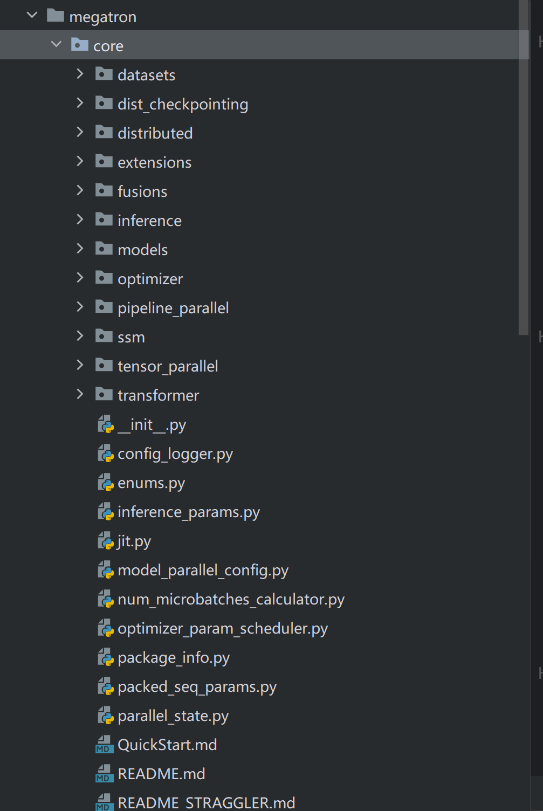
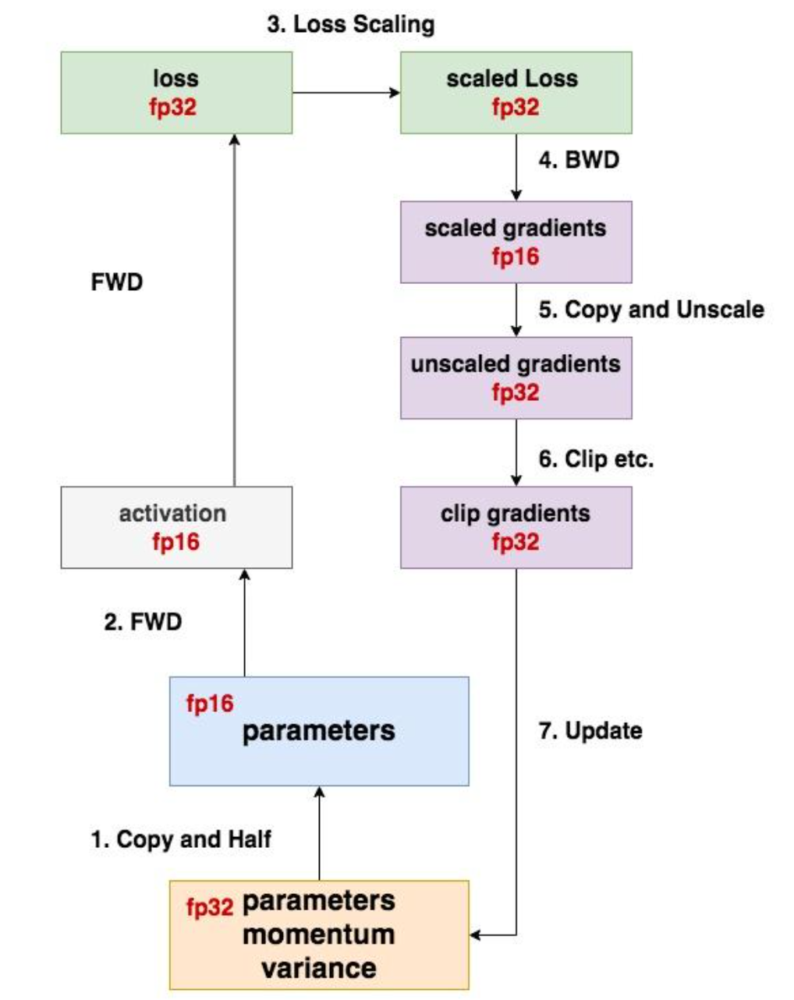
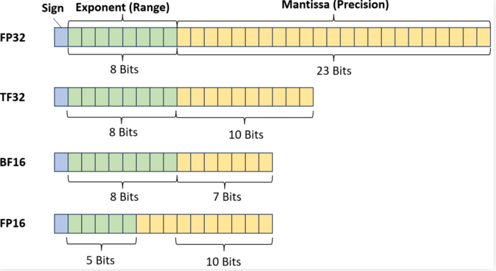

# 整体框架


整体框架如上图所示，训练和推理各自有其文件夹，文件夹下有对应的训练和推理api，然后core文件夹内有这最核心的一些组件的实现，如optimizer、models、Transformer和各种并行和分布式通讯的库。

# 并行初始化

megatron的并行初始化调用的是initialize_megatron()，内部会调用initialize_model_parallel()，接下来我们看看这个函数是如何对DP、PP、TP、CP、EP进行通讯域初始化的：

```
""" 函数的参数太多了，这里省略 """
def initialize_model_parallel(...) -> None:
    """ 初始化DP并行组 """
    ... # 全局变量获取
    for ranks in generator_wrapper('dp'):
        group = torch.distributed.new_group(ranks, timeout=timeout, pg_options=get_nccl_options('dp', nccl_comm_cfgs))
        group_gloo = torch.distributed.new_group(ranks, timeout=timeout, backend="gloo")
        if rank in ranks:
            """ 
            这里的if判断的逻辑是：只有我这个训练进程的rank在这个group里我才会把我这个训练进程的并行通信组设置为刚才创建出来的group。
            而这个group的类型是pytorch的ProcessGroup对象，对于下面所有的并行组的创建都是走的这个逻辑。
            """
            _DATA_PARALLEL_GROUP = group
            _DATA_PARALLEL_GROUP_GLOO = group_gloo
            _DATA_PARALLEL_GLOBAL_RANKS = ranks
  
    """ 初始化DP-CP并行组，由于CP的并行逻辑原因，DP和CP的分组可以共用一个通信组 """
    for ranks_with_cp in generator_wrapper('dp-cp'):
        group_with_cp = torch.distributed.new_group(ranks_with_cp, timeout=timeout, pg_options=get_nccl_options('dp_cp', nccl_comm_cfgs))
        group_with_cp_gloo = torch.distributed.new_group(ranks_with_cp, timeout=timeout, backend="gloo")
        if rank in ranks_with_cp:
             # do samething
   
    ...

    """ 初始化CP并行组 """
    ... # 全局变量获取
    for ranks in generator_wrapper('cp'):
        group = torch.distributed.new_group(ranks, timeout=timeout, pg_options=get_nccl_options('cp', nccl_comm_cfgs))
        if rank in ranks:
            # do samething

    """ 初始化DP域并行组，这个group内包含了一个完整模型参数所需的rank号 """
    ... # 全局变量获取
    for ranks in generator_wrapper('tp-pp'):
        group = torch.distributed.new_group(ranks, timeout=timeout, pg_options=get_nccl_options('mp', nccl_comm_cfgs))
        if rank in ranks:
            # do samething
    ...
   
    """ 初始化TP并行组 """
    ... # 全局变量获取
    for ranks in generator_wrapper('tp'):
        group = torch.distributed.new_group(ranks, timeout=timeout, pg_options=get_nccl_options('tp', nccl_comm_cfgs))
        if rank in ranks:
            # do samething

    """ 初始化PP并行组 """
    ... # 全局变量获取
    for ranks in generator_wrapper('pp'):
        group = torch.distributed.new_group(ranks, timeout=timeout, pg_options=get_nccl_options('pp', nccl_comm_cfgs))
        if rank in ranks:
            if _PIPELINE_MODEL_PARALLEL_GROUP is None:
                _PIPELINE_MODEL_PARALLEL_GROUP = group
                _PIPELINE_GLOBAL_RANKS = ranks
            elif isinstance(_PIPELINE_GLOBAL_RANKS[0], list):
                _PIPELINE_MODEL_PARALLEL_GROUP.append(group)
                _PIPELINE_GLOBAL_RANKS.append(ranks)
            else:
                _PIPELINE_MODEL_PARALLEL_GROUP = [_PIPELINE_MODEL_PARALLEL_GROUP, group]
                _PIPELINE_GLOBAL_RANKS = [_PIPELINE_GLOBAL_RANKS, ranks]

        embedding_ranks = get_embedding_ranks(ranks)
        group = torch.distributed.new_group(embedding_ranks, timeout=timeout, pg_options=get_nccl_options('embd', nccl_comm_cfgs))
        if rank in embedding_ranks:
            # do samething

        position_embedding_ranks = get_position_embedding_ranks(ranks)
        group = torch.distributed.new_group(...)
        if rank in position_embedding_ranks:
            # do samething
   
    """ 初始化TP+CP并行组，这个并行组用于提升效率，因为Attention层前TP和CP并行组都会调用all-gather，所以可以合并 """
    ... # 全局变量获取
    for ranks in generator_wrapper('tp-cp'):
        group = torch.distributed.new_group(ranks, timeout=timeout, pg_options=get_nccl_options('tp_cp', nccl_comm_cfgs))
        if rank in ranks:
           # do samething
  
    ... """ EP，TP+EP等等 """ 

    _set_global_memory_buffer()
```

### Megatron 如何分组？—— 以 TP=2, PP=2, DP=2 为例（共 8 GPU）

#### 📌 步骤 1：按 PP 划分 —— 2 个流水 stage

* Stage 0: GPU [0, 1, 2, 3]
* Stage 1: GPU [4, 5, 6, 7]

#### 📌 步骤 2：在每个 stage 内，按 DP 划分 —— 2 个数据并行组

* Stage 0:
  * DP Group 0: [0, 2]
  * DP Group 1: [1, 3]
* Stage 1:
  * DP Group 0: [4, 6]
  * DP Group 1: [5, 7]

#### 📌 步骤 3：在每个 DP 组内，按 TP 划分 —— 2 个张量并行组

* Stage 0, DP Group 0: [0, 2] → TP 组就是 [0, 2]（TP=2，刚好2个）
* Stage 0, DP Group 1: [1, 3] → TP 组是 [1, 3]
* Stage 1, DP Group 0: [4, 6] → TP 组 [4, 6]
* Stage 1, DP Group 1: [5, 7] → TP 组 [5, 7]

## data\_iterator创建

在当前绝大多数场景下，我们都是用的gpt模型进行训练，对应的megatron也有`GPTDataset`，我们在启动训练前就会创建出`data_iterator`和`Dataloader`，接下来我们看看megatron是如何创建这些关键组件的

```python
def train_valid_test_datasets_provider(train_val_test_num_samples):
    args = get_args()

    config = core_gpt_dataset_config_from_args(args)

    if config.mock:
        dataset_type = MockGPTDataset
    else:
        dataset_type = GPTDataset   """ 使用的数据集类型 """
    print_rank_0("> building train, validation, and test datasets for GPT ...")

    if args.is_instruction_dataset:
        ...  """ 很少用 """
    else:
        """ 关键函数 """
        train_ds, valid_ds, test_ds = BlendedMegatronDatasetBuilder(dataset_type, train_val_test_num_samples, is_dataset_built_on_rank, config).build()

    print_rank_0("> finished creating GPT datasets ...")

    return train_ds, valid_ds, test_ds
```

上面的代码进入到了BlendedMegatronDatasetBuilder内进行数据集创建，这内部的代码十分冗长，逻辑比较复杂，故放到进阶内容的7.1节进行详细讲述。接下来粗略讲述一下data-iterator的创建

```python
def pretrain(...):
    # Initalize and get arguments, timers, and Tensorboard writer.
    initialize_megatron(...) 
    ...
    # Model, optimizer, and learning rate.
    model, optimizer, opt_param_scheduler = setup_model_and_optimizer(model_provider, model_type)
    ...
    # Data stuff.
    if args.virtual_pipeline_model_parallel_size is not None:
        train_data_iterator = []
        valid_data_iterator = []
        test_data_iterator = []
        for i in range(len(model)):
            mpu.set_virtual_pipeline_model_parallel_rank(i)
            iterators = build_train_valid_test_data_iterators(
                train_valid_test_dataset_provider)
            train_data_iterator.append(iterators[0])
            valid_data_iterator.append(iterators[1])
            test_data_iterator.append(iterators[2])
    else:
        """ VPP未启用时的逻辑，我们大多数时候都走这里 """
        train_data_iterator, valid_data_iterator, test_data_iterator = build_train_valid_test_data_iterators(train_valid_test_dataset_provider)
    print_datetime('after dataloaders are built')


def build_train_valid_test_data_iterators(build_train_valid_test_datasets_provider):
    args = get_args()

    """ 使用我们这一章节最开始给出的那个dataset provider函数创建数据集和Dataloader """
    train_dataloader, valid_dataloader, test_dataloader = build_train_valid_test_data_loaders(build_train_valid_test_datasets_provider)

    # Build iterators.
    dl_type = args.dataloader_type
    assert dl_type in ['single', 'cyclic', 'external']

    def _get_iterator(dataloader_type, dataloader):
        """Return dataset iterator."""
        if dataloader_type == "single":
            return iter(dataloader)
        elif dataloader_type == "cyclic":
            return iter(cyclic_iter(dataloader))
        elif dataloader_type == "external":
            # External dataloader is passed through. User is expected to define how to iterate.
            return dataloader
        else:
            raise RuntimeError("unexpected dataloader type")

    if train_dataloader is not None:
        train_data_iterator = _get_iterator(dl_type, train_dataloader)
    else:
        train_data_iterator = None
    if valid_dataloader is not None:
        valid_data_iterator = _get_iterator(dl_type, valid_dataloader)
    else:
        valid_data_iterator = None
    if test_dataloader is not None:
        test_data_iterator = _get_iterator(dl_type, test_dataloader)
    else:
        test_data_iterator = None
    """ 这个iterator就是将Dataloader包装为可迭代的对象，以方便在gpt_forward_step中使用next(data_iterator)获得数据 """ 
    return train_data_iterator, valid_data_iterator, test_data_iterator
```

从上面可以看到创建的过程，其中Dataloader的创建我这里省略，因为这里读者们自己可以去阅读一下代码，其实已经很容易就能够串起开始的dataset创建和上面给出的iterator创建的过程。

在Dataloader创建的函数中会先创建出三个dataset【train，valid，test】，然后根据三个dataset各自创建出对应的Dataloader【这里的Dataloader就是pytorch的Dataloader】。

有了dataloader之后我们就可以在训练中进行batch数据读取了，这里的逻辑笔者放在下一章的预训练中讲述。

# 预训练：

## 基于iteration的训练：

与传统的机器学习基于epoch来训练的模式不同，LLM内没有了epoch的概念，只有`iteration`的概念——即这次训练会进行N\*M个`forward-backward`操作，N个`step`操作。（`N = iteration`，`M = global_batch_size / micro_batch_size`）

下面我们从代码上看看基于iteration的训练代码：

```python
def train(forward_step_func, model, optimizer, opt_param_scheduler, train_data_iterator, valid_data_iterator, process_non_loss_data_func, config):
    args = get_args()
    timers = get_timers()

    # Turn on training mode which enables dropout.
    for model_module in model:
        model_module.train()

    # Tracking loss.
    total_loss_dict = {}

    # Iterations.
    iteration = args.iteration

    ... # Setup some training config params
  
    """ 最重要的while训练，里面执行iteration次train_step函数 """
    num_microbatches = get_num_microbatches()
    while iteration < args.train_iters:
        ... """ 更新num microbatch大小 """

        args.curr_iteration = iteration
        """ 调用train_step训练一个step【fwd、bwd、optimizer.step】 """
        loss_dict, skipped_iter, grad_norm, num_zeros_in_grad = \
            train_step(forward_step_func,
                       train_data_iterator,
                       model,
                       optimizer,
                       opt_param_scheduler,
                       config)
        iteration += 1
        batch_size = mpu.get_data_parallel_world_size() * \
                     args.micro_batch_size * \
                     get_num_microbatches()
        args.consumed_train_samples += batch_size
  
        ... """ logging相关代码 """

        ... """ Evaluation """
  
        ... """ Checkpointing 保存权重文件 """ 
  
    ... """ 所有iteration完成之后的退出逻辑 """

    return iteration, num_floating_point_operations_so_far
```

## train\_step函数：

在megatron中，`forward`和`backward`因为流水线并行而需要定制，所以我们不能像原始的机器学习一样直接把input放入model，然后调用`loss.backward()`计算梯度。原因就是每张卡里的model其实都不一样，对于输入的shape的要求也不一样，

所以我们需要包装`forward`的input，有可能这个input是最开始的输入，也有可能是上一个pipeline stage的output。接下来我们看看对于流水线并行来说`forward`和`backward`的流程：

```python
def train_step(...):
    ...
    """ 清除grad """
    if args.DDP_impl == 'local' and args.use_contiguous_buffers_in_local_ddp:
        for partition in model:
            partition.zero_grad_buffer()
    optimizer.zero_grad()
    ...
  
    """ 执行前向、反向计算 """
    forward_backward_func = get_forward_backward_func()  """ 获得forward和backward函数，里面会根据PP的设置返回不同的函数 """
    losses_reduced = forward_backward_func(...) 
    ...
  
    """ 对梯度执行Reduce-Scatter操作 """
    optimizer.reduce_model_grads(args, timers)
    ...
  
    """ 更新该DP域持有的梯度对应的部分参数 """
    timers('optimizer', log_level=1).start(barrier=args.barrier_with_L1_time)
    update_successful, grad_norm, num_zeros_in_grad = optimizer.step(args, timers)
    timers('optimizer').stop()
    ...
  
    """ 对更新后的param执行gather操作 """
    if update_successful:
        optimizer.gather_model_params(args, timers)
    ...
  
    """ 通过scheduler更新学习率 """
    if update_successful:
        increment = get_num_microbatches() * args.micro_batch_size * args.data_parallel_size
        opt_param_scheduler.step(increment=increment)
        skipped_iter = 0
    else:
        skipped_iter = 1
    ...
```

在将fwd和bwd之前，我们有必要了解一下global_batch_size, micro_batch_size, DP_size和num_micro_batches的关系：

```python
 self.num_micro_batches = (running_global_batch_size // micro_batch_times_data_parallel_size)  # 16 // (2 * 4) = 2
```

我们在训练的脚本里会指定这两个size参数，然后megatron会根据DP的数量计算出来这个num_micro_batches的大小，这个数的用处很大，接下来我们将fwd-bwd的时候就会讲到。

```python
def get_forward_backward_func():
    pipeline_model_parallel_size = parallel_state.get_pipeline_model_parallel_world_size()
    if pipeline_model_parallel_size > 1:
        if parallel_state.get_virtual_pipeline_model_parallel_world_size() is not None:
            forward_backward_func = forward_backward_pipelining_with_interleaving
        else:
            forward_backward_func = forward_backward_pipelining_without_interleaving   """ 着重看VPP不设置的情况下的fwd-bwd函数 """
    else:
        forward_backward_func = forward_backward_no_pipelining
    return forward_backward_func


def forward_backward_pipelining_without_interleaving(......):
    ... """ 省略的是一些梯度同步相关的设置以及assert """

    """ microbatches计算 """
    num_warmup_microbatches = (parallel_state.get_pipeline_model_parallel_world_size() - parallel_state.get_pipeline_model_parallel_rank() - 1)
    num_warmup_microbatches = min(num_warmup_microbatches, num_microbatches)
    num_microbatches_remaining = num_microbatches - num_warmup_microbatches

    if config.num_microbatches_with_partial_activation_checkpoints is not None:
        max_outstanding_backprops = num_warmup_microbatches + 1

    model_type = get_model_type(model)

    rank = parallel_state.get_pipeline_model_parallel_rank()
    ...

    # Input, output tensors only need to be saved when doing backward passes
    input_tensors = None
    output_tensors = None
    if not forward_only:
        input_tensors = []
        output_tensors = []
    forward_data_store = []

    """ 注意！，这里都是循环，每次循环都会调用一次forward，所以一个iteration不只会调用一次fwd-bwd，而是会循环调用num_micro_batches次。""" 

    """ Run warmup forward passes. """
    for i in range(num_warmup_microbatches):
        ...
        """ 从上一个stage获得input tensor 【如果是第一个stage则直接获得输入】"""
        input_tensor = recv_forward(recv_tensor_shapes, config)
        """ 执行forward函数，并将output发送给下一个stage """
        output_tensor = forward_step()
        send_forward(output_tensor, send_tensor_shapes, config)

        if not forward_only:
            input_tensors.append(input_tensor)
            output_tensors.append(output_tensor)
            deallocate_output_tensor(output_tensor[0], config.deallocate_pipeline_outputs)

    """ 
    完成热身forward之后开始fwd-bwd，上面的热身其实就是填充流水线的意思：
    我们想要执行bwd，那么首先得第一个batch的数据执行完整个fwd流程，填充完之后每个stage就进入了一个fwd一个bwd的稳定阶段.
    """
    # Before running 1F1B, need to receive first forward tensor. If all microbatches are run in warmup / cooldown phase, then no need to receive this tensor here.
    if num_microbatches_remaining > 0:
        input_tensor = recv_forward(recv_tensor_shapes, config)

    """ Run 1F1B in steady state.  """
    for i in range(num_microbatches_remaining):
        last_iteration = i == (num_microbatches_remaining - 1)
        ...
        """ 执行forward函数，并将output发送给下一个stage """
        output_tensor = forward_step(...)

        """ forward_only表示推理场景 """
        if forward_only:
            send_forward(output_tensor, send_tensor_shapes, config)

            if not last_iteration:
                input_tensor = recv_forward(recv_tensor_shapes, config)
        else:
            """ 
            训练场景下将发送forward的output和接收backward的grad合并。
            因为这里是热身之后的场景，流水线已经被填充，每个forward stage完成就对应了一个backward stage的完成 
            """
            output_tensor_grad = send_forward_recv_backward(output_tensor, send_tensor_shapes, config)

            # Add input_tensor and output_tensor to end of list.
            input_tensors.append(input_tensor)
            output_tensors.append(output_tensor)
            deallocate_output_tensor(output_tensor[0], config.deallocate_pipeline_outputs)

            # Pop input_tensor and output_tensor from the start of the list for the backward pass.
            input_tensor = input_tensors.pop(0)
            output_tensor = output_tensors.pop(0)

            # Enable grad sync for the last microbatch in the batch if the full backward pass completes in the 1F1B stage.
            if num_warmup_microbatches == 0 and last_iteration:
                if config.grad_sync_func is None or rank == 0:
                    enable_grad_sync()
  
            """
            执行backward，对应的梯度计算需要用到前面获取到的output的梯度【也即下一个stage计算backward的梯度以及本stage中forward的output_tensor】
            有了这三个数据后便可以计算出本stage的input_tensor的梯度，然后把这个梯度又发送给上一个stage【如果有的话】。
            """
            input_tensor_grad = backward_step(input_tensor, output_tensor, output_tensor_grad, model_type, config)

            if last_iteration:
                input_tensor = None
                send_backward(input_tensor_grad, recv_tensor_shapes, config)
            else:
                input_tensor = send_backward_recv_forward(input_tensor_grad, recv_tensor_shapes, config)

    """ Run cooldown backward passes. 把流水线中剩下的backward stage完成 """
    if not forward_only:
        for i in range(num_warmup_microbatches):
            if i == num_warmup_microbatches - 1:
                if config.grad_sync_func is None or rank == 0:
                    enable_grad_sync()

            input_tensor = input_tensors.pop(0)
            output_tensor = output_tensors.pop(0)

            output_tensor_grad = recv_backward(send_tensor_shapes, config)

            input_tensor_grad = backward_step(input_tensor, output_tensor, output_tensor_grad, model_type, config)

            send_backward(input_tensor_grad, recv_tensor_shapes, config)

    ...  """ 梯度同步、计时和清理 """

    return forward_data_store
```

> `forward_step()` 用的 `input_tensor` 被 `append` 到 `input_tensors` 列表末尾
> `backward_step()` 用的 `input_tensor` 是从 `input_tensors` **前端 `pop`** 出来的

> **因为在流水并行中，反向传播的执行顺序与前向传播是“镜像相反”的 —— 最后一个 stage 最先开始反向，第一个 stage 最后反向。因此，激活值（input_tensor）必须按“先进先出”（FIFO）顺序管理，才能保证反向时拿到正确的、对应 microbatch 的输入。**

##### 流水并行中的 Microbatch 执行顺序

假设：

- 流水线有 4 个 stage（S0, S1, S2, S3）
- 有 4 个 microbatch（MB0, MB1, MB2, MB3）

前向传播（Forward）执行顺序（时间步）：

→ **前向顺序：每个 stage 按 MB0 → MB1 → MB2 → MB3 顺序处理**

---

#### 反向传播（Backward）执行顺序

反向传播必须从**最后一个 stage（S3）开始**，因为：

- 损失函数在 S3 输出后计算
- 梯度从 S3 开始反向传播 → S2 → S1 → S0

而且，为了匹配前向的 microbatch，反向也必须按 microbatch 顺序进行。

但注意：**S3 最先完成 MB0 的前向 → 所以它最先开始 MB0 的反向！**

### 🔄 反向传播执行顺序（理想同步情况）：

→ **反向顺序：每个 stage 按 MB0 → MB1 → MB2 → MB3 顺序处理（和前向一致）**

BUT —— 注意：**S3 先反向 MB0，S2 在稍后反向 MB0，S1 更晚，S0 最晚。**

---

#### 每个 stage 如何保存和取出 input_tensor？

在前向传播中，每个 stage 对每个 microbatch 都会：

1. 接收 `input_tensor`（来自上一 stage 或数据加载器）
2. 计算 `output_tensor`
3. **把 `input_tensor` 保存起来** → 因为反向传播时需要它来计算梯度（尤其是用了激活重计算时）
4. 把 `output_tensor` 发送给下一 stage

→ 所以每个 stage 都需要一个 **队列（list）** 来存储它处理过的所有 microbatch 的 `input_tensor`

---

#### 为什么是 append + pop(0)？—— FIFO！

现在我们聚焦在一个 stage 上，比如 **S1**。

### 前向时（按顺序处理 MB0, MB1, MB2, MB3）：

```python
input_tensors = []

# 处理 MB0
input_tensor_0 = receive_from_S0()
output_tensor_0 = forward_step(input_tensor_0)
input_tensors.append(input_tensor_0)   # → [inp0]

# 处理 MB1
input_tensor_1 = receive_from_S0()
output_tensor_1 = forward_step(input_tensor_1)
input_tensors.append(input_tensor_1)   # → [inp0, inp1]

# 处理 MB2
input_tensors.append(input_tensor_2)   # → [inp0, inp1, inp2]

# 处理 MB3
input_tensors.append(input_tensor_3)   # → [inp0, inp1, inp2, inp3]
```

### 反向时（S1 必须在 S2 开始反向 MB0 之后，才能开始反向 MB0）：

```python
# 当 S2 开始反向 MB0 时，它会把梯度传给 S1
# S1 需要 MB0 的 input_tensor 来计算自己的梯度

input_tensor_for_bw = input_tensors.pop(0)  # ← 取出 inp0
grad_output = receive_grad_from_S2()        # MB0 的梯度
grad_input = backward_step(input_tensor_for_bw, grad_output)
send_grad_to_S0(grad_input)
```

→ 然后是 MB1：

```python
input_tensor_for_bw = input_tensors.pop(0)  # ← 取出 inp1（现在列表是 [inp2, inp3]）
...
```

📌 **必须按 MB0, MB1, MB2, MB3 的顺序反向 → 所以必须按“先进先出”顺序取出 input_tensor**

---

#### input_tensors 队列变化

```
前向：
  MB0 → append → [inp0]
  MB1 → append → [inp0, inp1]
  MB2 → append → [inp0, inp1, inp2]
  MB3 → append → [inp0, inp1, inp2, inp3]

反向：
  BW MB0 → pop(0) → inp0, 剩下 [inp1, inp2, inp3]
  BW MB1 → pop(0) → inp1, 剩下 [inp2, inp3]
  BW MB2 → pop(0) → inp2, 剩下 [inp3]
  BW MB3 → pop(0) → inp3, 剩下 []
```

#### 为什么 output_tensors 也是 FIFO？

你提到还有 `output_tensors` —— 它通常用于：

- 在反向传播时，把前向的 `output_tensor` 传给 `torch.autograd.backward()`（如果没用激活重计算）

它的使用顺序和 `input_tensors` 一致 —— **反向时也需要按 MB0, MB1... 顺序取出对应的 output_tensor**

```python
output_tensors.append(output_tensor)   # forward 时
...
output_tensor_for_bw = output_tensors.pop(0)  # backward 时
```

## forward\_step：

```python
""" 位于PIPELINE内的forward_step，下面那个短的forward_step才是最终的 """
def forward_step(......):
    ... """ timers and set first microbatch """ 

    unwrap_output_tensor = False
    if not isinstance(input_tensor, list):
        input_tensor = [input_tensor]
        unwrap_output_tensor = True

    set_input_tensor = get_attr_wrapped_model(model, "set_input_tensor")
    set_input_tensor(input_tensor)

    if config.enable_autocast:
        context_manager = torch.autocast("cuda", dtype=config.autocast_dtype)
    else:
        context_manager = contextlib.nullcontext()
    with context_manager:
        """ 执行前向传播计算 """
        if checkpoint_activations_microbatch is None:
            output_tensor, loss_func = forward_step_func(data_iterator, model)
        else:
            output_tensor, loss_func = forward_step_func(data_iterator, model, checkpoint_activations_microbatch)
    """
    最后一个流水线stage时计算loss，
    需要注意的是：下面有个loss和loss_reduced，这两个loss前者是用于反向传播的，后者是用来打印日志的。
    后者本append进forward_data_store这个字典内，最终会被再次平均【字典内所有loss求和再除字典长度】
    """
    if parallel_state.is_pipeline_last_stage():
        if not collect_non_loss_data:
            output_tensor = loss_func(output_tensor)
            loss, loss_reduced = output_tensor
            output_tensor = loss / num_microbatches
            forward_data_store.append(loss_reduced)
        else:
            data = loss_func(output_tensor, non_loss_data=True)
            forward_data_store.append(data)

    ... """ timer计时和使用moe下的loss scale设置 """

    if unwrap_output_tensor:
        return output_tensor
    return [output_tensor]
```

在pipeline_parallel/schedules.py文件下的forward_step()还是包装了真正的forward_step函数【即上面代码中的forward_step_func】，而这个forward_step_func其实和模型类型相关——即不同模型的forward_step_func有些许区别，megatron为了统一接口才包装了这么多层forward_step函数。
下面我们看看gpt和t5模型的forward_step函数：

```python
def forward_step(data_iterator, model: GPTModel):
    """ GPT Forward training step.
    Args:
        data_iterator : Input data iterator
        model (GPTModel): The GPT Model
    """
    args = get_args()
    timers = get_timers()

    # Get the batch.
    timers('batch-generator', log_level=2).start()
    """ 这个关键函数从Dataloader里获取了一个batch的数据 """
    tokens, labels, loss_mask, attention_mask, position_ids = get_batch(data_iterator)  
    timers('batch-generator').stop()

    """ 真正的forward计算 """ 
    output_tensor = model(tokens, position_ids, attention_mask, labels=labels)

    return output_tensor, partial(loss_func, loss_mask)


def forward_step(data_iterator, model: T5Model):
    """ t5 Forward training step.
    Args:
        data_iterator : Input data iterator
        model (T5Model): The T5 Model
    """
    args = get_args()
    timers = get_timers()

    # Get the batch.
    timers('batch generator', log_level=2).start()
    use_local = args.transformer_impl == "local"
    """ 这个关键函数从Dataloader里获取了一个batch的数据 """
    tokens_enc, tokens_dec, loss_mask, lm_labels, enc_mask, dec_mask, enc_dec_mask = get_batch(data_iterator, use_local)
    timers('batch generator').stop()

    """ 真正的forward计算, Forward model lm_labels """
    output_tensor = model(tokens_enc, tokens_dec, enc_mask, dec_mask, enc_dec_mask, lm_labels=lm_labels)

    return output_tensor, partial(loss_func, loss_mask)
```

从上面的代码我们可以看到由于模型不同，传入output_tensor = model(...)的参数也不一样，所以forward_step就会不同。

而针对model内部的前向计算我们将其放在文章最后的进阶内容中讲述。【设计的内容主要是张量并行，megatron对于Transformer的多头注意力和MLP张量并行版本实现】。

## get\_batch:

上面的代码中提到了`get_batch()`【位于`pretrain_gpt.py`】我们接下来着重讲讲数据如何读取：

**【megatron里的数据并行是依靠每个DP域内的第一个PP stage的rank0卡各读取的一次数据，那么N个DP域就一共会读取N个`micro_batch_size`大小的数据，这个`N * micro_batch_size`的倍数对应了`global_batch_size`】**

```python
def get_batch(data_iterator):
    if (not mpu.is_pipeline_first_stage()) and (not mpu.is_pipeline_last_stage()):
        return None, None, None, None, None

    """ 一个张量并行组内获取一个batch的数据 """
    batch = get_batch_on_this_tp_rank(data_iterator)  

    """ 一个上下文并行组内获取一个batch的数据，同时按sequence维度切分这个batch的数据给到CP组内不同的训练进程 """
    batch = get_batch_on_this_cp_rank(batch) 
    return batch.values()
```

get_batch()函数经历了两个get的过程，一个是TP组内，一个是CP组内，我们接下来分别讲述这两个过程。

```python
def get_batch_on_this_tp_rank(data_iterator):
    args = get_args()

    def _broadcast(item):
       if item is not None:
           """ 
           broacast集合通信操作的第一个参数是tensor数据，第二个参数是数据的发送者，第三个参数是给哪些进程发送。
           这里使用这个集合通信操作的原因是一个TP组内只有组内的rank0进程才会从cpu内存侧读取数据集到NPU中，然后其
           会使用NPU卡间的广播操作把数据集广播给组内的其他NPU【这样的效率比所有卡都从cpu内存中读取要快的多】
           """
           torch.distributed.broadcast(item, mpu.get_tensor_model_parallel_src_rank(), group=mpu.get_tensor_model_parallel_group())

    if mpu.get_tensor_model_parallel_rank() == 0:
       """ if的条件是TP组的rank0才会满足的，然后只有这个训练进程才会从data_iterator中读取到data数据 """ 
       if data_iterator is not None:
           data = next(data_iterator)
       else:
           data = None
   
       """ 使用数据构造一个batch """
       batch = {
           'tokens': data["tokens"].cuda(non_blocking = True),
           'labels': data["labels"].cuda(non_blocking = True),
           'loss_mask': data["loss_mask"].cuda(non_blocking = True),
           'attention_mask': None if "attention_mask" not in data else data["attention_mask"].cuda(non_blocking = True),
           'position_ids': data["position_ids"].cuda(non_blocking = True)
       }
       """ 调用上面的broadcast操作把数据发送给组内其他的rank """
       if args.pipeline_model_parallel_size == 1:
           _broadcast(batch['tokens'])
           _broadcast(batch['labels'])
           _broadcast(batch['loss_mask'])
           _broadcast(batch['attention_mask'])
           _broadcast(batch['position_ids'])
       elif mpu.is_pipeline_first_stage():
           _broadcast(batch['tokens'])
           _broadcast(batch['attention_mask'])
           _broadcast(batch['position_ids'])
       elif mpu.is_pipeline_last_stage():
           _broadcast(batch['labels'])
           _broadcast(batch['loss_mask'])
           _broadcast(batch['attention_mask'])
    else:
       """ 组内非rank0训练进程的tokens和labels都是空张量，其都调用broadcast操作等待rank0把数据发给这些rank """
       tokens=torch.empty((args.micro_batch_size,args.seq_length), dtype = torch.int64 , device = torch.cuda.current_device())
       labels=torch.empty((args.micro_batch_size,args.seq_length), dtype = torch.int64 , device = torch.cuda.current_device())
       loss_mask=torch.empty((args.micro_batch_size,args.seq_length), dtype = torch.float32 , device = torch.cuda.current_device())
       ...
       position_ids=torch.empty((args.micro_batch_size,args.seq_length), dtype = torch.int64 , device = torch.cuda.current_device())

       if args.pipeline_model_parallel_size == 1:
           _broadcast(tokens)
           _broadcast(labels)
           _broadcast(loss_mask)
           _broadcast(attention_mask)
           _broadcast(position_ids)
       elif mpu.is_pipeline_first_stage():
           labels=None
           loss_mask=None
           _broadcast(tokens)
           _broadcast(attention_mask)
           _broadcast(position_ids)
       elif mpu.is_pipeline_last_stage():
           tokens=None
           position_ids=None
           _broadcast(labels)
           _broadcast(loss_mask)
           _broadcast(attention_mask)
 
       batch = {
           'tokens': tokens,
           'labels': labels,
           'loss_mask': loss_mask,
           'attention_mask': attention_mask,
           'position_ids': position_ids
       }

    return batch

```

接下来我们再看看CP的batch读取：

```python
def get_batch_on_this_cp_rank(batch):
    args = get_args()
    cp_size = args.context_parallel_size
    if cp_size > 1:
        cp_rank = mpu.get_context_parallel_rank()
        for key, val in batch.items():
            if val is not None:
                seq_dim = 1 if key != 'attention_mask' else 2
                """ 只拿一部分sequence长度的数据 """
                val = val.view(
                    *val.shape[0:seq_dim],
                    2 * cp_size,
                    val.shape[seq_dim] // (2 * cp_size),
                    *val.shape[(seq_dim + 1) :],
                )
                index = torch.tensor([cp_rank, (2 * cp_size - cp_rank - 1)], 
                                     device="cpu", pin_memory=True).cuda(non_blocking=True)
                val = val.index_select(seq_dim, index)
                val = val.view(*val.shape[0:seq_dim], -1, *val.shape[(seq_dim + 2) :])
                batch[key] = val

    return batch
```

对于CP组的batch而言也很容易理解，传入这个函数的batch是从TP组获得的batch中，这个CPrank内的卡把一个完成sequence长度的batch数据抽出属于自己的一部分，然后其余部分丢弃。同时值得注意的是sequence会被切分为两倍的CP大小的chunk，这样做主要是为了负载均衡。

看到这里再结合第二章并行初始化的知识，我相信你一定有个疑问——两个CP并行域内是如何确保拿到的是同一个batch的数据的呢？

答案：得益于megatron的sampler的设计，由于两个CP并行域的DP rank是一样的，所以在next(data_iterator)的时候调用__iter__函数yield的batch idx是一样的，如此才能够保证CP并行域内的数据是同一批。

【代码细节可以在megatron/legacy/data/data_sampler.py中看到】

## backward\_step：

上一节的`forward_step`和`get_batch`包装了很多很多层，但`backward_step`就会好很多

```python
def backward_step(input_tensor, output_tensor, output_tensor_grad, model_type, config):
  
    unwrap_input_tensor_grad = False
    if not isinstance(input_tensor, list):
        input_tensor = [input_tensor]
        unwrap_input_tensor_grad = True
    for x in input_tensor:
        if x is not None:
            x.retain_grad()

    if not isinstance(output_tensor, list):
        output_tensor = [output_tensor]
    if not isinstance(output_tensor_grad, list):
        output_tensor_grad = [output_tensor_grad]

    """ Backward pass. 根据output_tensor和output_tensor_grad计算出input_tensor的梯度 """
    if output_tensor_grad[0] is None and config.grad_scale_func is not None:
        output_tensor[0] = config.grad_scale_func(output_tensor[0])

    if config.deallocate_pipeline_outputs:
        custom_backward(output_tensor[0], output_tensor_grad[0])
    else:
        torch.autograd.backward(output_tensor[0], grad_tensors=output_tensor_grad[0])

    # Collect the grad of the input_tensor.
    input_tensor_grad = [None]
    if input_tensor is not None:
        input_tensor_grad = []
        for x in input_tensor:
            if x is None:
                input_tensor_grad.append(None)
            else:
                input_tensor_grad.append(x.grad)

    ... """ skip layer相关的逻辑 """ 

    return input_tensor_grad
```

# 分布式优化器：

megatron的分布式优化器是十分重要的一个组件，其既是分布式的又是混合精度的，也就是说在forward-backward、step的过程中使用的模型参数的精度是不一样的。下面这张图将展示出来各步骤用的精度：


上图的流程大致为如下逻辑：


上图的流程大致为如下逻辑：

* 从`main_params`将权重参数拷贝到`model_params`，然后使用`model_params`进行`forward`计算【这里的`main_params`保存的权重参数的精度为FP32，而`model_params`的精度为FP16】
* 将forward的Loss用于backward来计算梯度`scaled_grad`【这里的grad的精度也是FP16】
* 将scaled\_grad【FP16】拷贝到训练进程的grad buffer内，进行`reduce-scatter`，让这个rank持有的模型参数的DP组内有一个rank能有一个batch汇总平均过的梯度【FP16】
* 将上一步`reduce-scatter`汇总过的梯度【FP16】unscale为精度为FP32的梯度（unscale时还需要进行clip之类的梯度缩放操作，让梯度不要过大【避免梯度爆炸】），然后执行`optimizer.step()`对**这个rank所持有的分布式优化器内持有的优化器状态的shard所拥有的模型参数进行更新**【这里很绕，需要读者好好捋一捋，下面分布式优化器更新过程里会有进一步的阐述，但我们在这里需要记住一个概念——**由于模型并行的存在，每个rank内的model只是完整model的一个碎片**】
* 所有持有相同完整模型的碎片的rank【即一个DP通讯组里的所有rank】调用`all-gather`将上一步更新过的部分参数汇总起来，这样这个DP组里的所有rank就都有这个model碎片的完整的更新过的参数了
