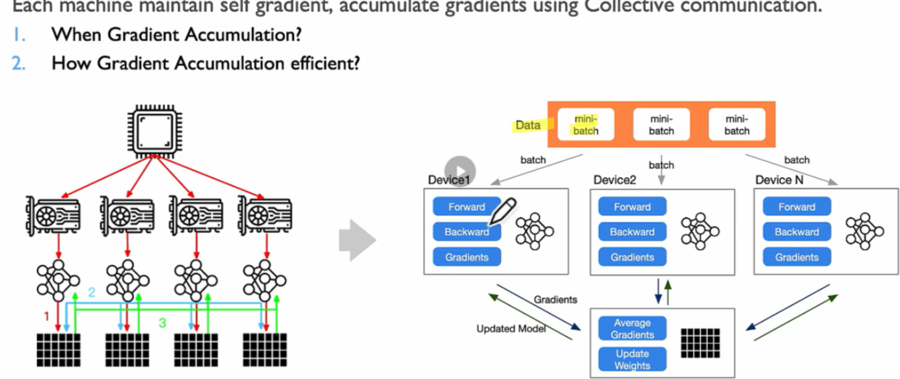

# 各类通信方式


| All-to-all     | 每个进程 ↔ 所有其他进程交换数据   | MoE、张量并行、数据重分布    |  |  |
| -------------- | ---------------------------------- | ---------------------------- | - | - |
| All-reduce     | 所有进程数据汇总后广播给所有人     | 梯度同步（数据并行训练）     |  |  |
| All-gather     | 每个进程数据收集起来，广播给所有人 | 收集各设备结果，拼接完整张量 |  |  |
| Broadcast      | 一个进程数据广播给所有人           | 初始化参数、广播输入         |  |  |
| Reduce-scatter | 各设备数据汇总后分片返回各设备     | 某些并行策略中的梯度分发     |  |  |

我们先看一个经典的3D矩阵乘法：


从这个图中就可以看出针对数据输入和模型参数都有切分规则，接下来我们就从这两个对象的切分维度上进行讲述。

## 数据上下文并行


在切分输入的并行中，我们可以从张量的不同维度进行切分。

* **batch维度：从batch进行切分就是我们熟知的数据并行，即把一个大的batch size切分到多个DP域内并行计算。**
* **sequence维度：由于LLM中一句话会切分成一串sequence，我们可以将sequence切分进行并行计算【Context Parallelism和Sequence Parallelism】**

### 数据并行


数据并行顾名思义就是把Input（batched）分散到不同的计算GPU上进行训练，**每个核心GPU各自完成反向传播计算出此部分数据的梯度，然后利用一个GPU节点接收其他所有GPU计算出的梯度，**

**将其累加求平均，然后再传回各个GPU进行权重更新**




同步式数据并行的缺点如下：**由于需要一个专门的GPU节点来累加梯度，所以节点就要等到最慢的那个GPU算完梯度之后才能完成累加，然后才能将平均后的梯度传回给各个GPU节点，这就导致了算的快的GPU产生了大量的空闲时间。**

故改进思路便是取消单个参数服务器，将所有GPU都作为参数服务器进行梯度同步。

**梯度累加算法改进（Ring AllReduce）：如下图所示，算法将只选择一个节点累加梯度改为所有节点都参与梯度的累加，所有节点采用环状旋转传播梯度。**

### Ring AllReduce算法

算法分为`Reduce-Scatter`和`Allgather`两个部分

#### Reduce-Scatter


每个GPU节点的发送和接收端只负责一部分数据（如GPU0只负责发送a数据，接收e数据）


第一个循环结束时GPU1的a数据已经含有自己的a1和从GPU0接收来的a0，即a0+a1


第四个循环结束时GPU4的a数据已经含有自己的a4和从GPU3接收来的a0+a1+a2+a3，即a0+a1+a2+a3+a4

**此时所有GPU都含有了完整的部分数据，GPU4含有了a的完整数据，GPU0含有b的完整数据.....然后我们就要将这些完整的数据再通过环状传播到所有GPU节点中去**


#### Allgather


GPU节点发送和接收的数据会随循环，GPU接收数据后不再是累加接收到的数据，而是用接收到的数据替换自己原有的数据


第一个循环后每个GPU都有了接收到的数据，此后的循环便是将接收到的数据再发送出去的过程


GPU2接收到了在iteration3时接收到了GPU1发送的a数据，然后在iteration4时便将数据a发给GPU3。其在iteration2时接收的其实是b数据，发送给GPU3的是c数据。从此可以看出，Allgather部分的流程中各个GPU节点接收和发送的数据是随循环改变的


经过p-1个循环后所有GPU便拥有了完整的所有数据


### 分布式数据并行（Distributed Data Parallelism）:

相较于数据并行， DDP在梯度传播的顺序和时机上做了优化。


从上图可以看出，GPU间不再等待模型的所有梯度都计算完才进行梯度传播，而是根据反向传播的特性（模型末端的梯度先被计算出来）从后往前在GPU间传播梯度，如上图的addmm2层的梯度会先被计算出来，

然后才会传播给addmm1层来计算addmm1的梯度，所以就可以先把addmm2层的梯度广播给其他的GPU【即图中的allreduce1】，这个思想便是gradient bucket【梯度分桶】，而产生的顺序便自然形成了reduce order。

这样的思想可以极大程度地利用GPU的资源，如我们在计算addmm1的梯度的同时也在广播addmm2的梯度给其他GPU，这样负责通信数据搬运和计算的模块都在工作

addmm

output = bias + mat1 @ mat2

bias = torch.randn(5)        # 形状 [5]
x = torch.randn(3, 4)        # 输入 [3, 4]
w = torch.randn(4, 5)        # 权重 [4, 5]

等价于：y = x @ w + bias

y = torch.addmm(bias, x, w)  # 输出形状 [3, 5]


### ZeRO 数据并行:

ZeRO算法是由DeepSpeed提出的，提出这种并行模式的原因是大模型的权重文件无法放入单个GPU中，故数据并行策略在LLM训练中无法使用，所以需要改进。


该种并行实际上是在DDP的基础上做了修改——每个GPU不存放完整的权重文件和优化器状态，而是只存放一部分，在GPU需要某一完整层的参数时所有GPU互相同步以提供各自拥有的部分。

从上图中可以看出，对于三种参数，可以自由选择哪个分散到各个GPU上，全部分散使得单个GPU显存占用最小。

详细一点分的话ZeRO可以分为三个stage：

* **Stage1：对应图中的`P_os`，即将Optimizer States（后简称OS）分散到各个GPU中。从图右侧的例子可以看到，仅分散OS便可以将显存占用从120GB/GPU变为31.4GB/GPU。**
* **Stage2：对应`P_os+g`，OS和Gradients都分散到各个GPU中去；**
* **Stage3：对应`P_os+g+p`，连同Parameters也分散到各个GPU中去【但这个用的比较少，因为汇总的时候要花较长时间】**


## 切分sequence——上下文、序列并行


【上图中AG=`all-gather`，RS=`reduce-scatter`，Attn=`Attention`，LN=`Layer Norm`】

上图中设置了TP=2，CP=2，有4张GPU进行计算，其中GPU0、1为一个TP通信组，GPU2、3为另一组，而CP通信组则为GPU0、2，GPU1、3【发没发现这个分组和DP一样的】，上下文并行的思路就是把一句话（比如有100个token），分到两个CP域内计算。

即GPU0和GPU2只计算一句话的前面一半的token的QKV，GPU1和GPU3计算另一半的QKV，然后再Attention block前调用all-gather汇聚前面各自CP域内计算好的KV，从而能够正常地进行Attention计算。

通过这样的切分，**每个CP域内的GPU就不再需要存储一堆完整大小的input的activation，其显存减少量为原来的CP Size分之一**，在QKV计算时也会减少相应的显存使用量。


### 序列并行（Sequence Parallelism）：

在megatron的实现中，序列并行在张量并行组内进行切分，将VocabEmbedding的输出切分成TP份，每个TP rank拿各自的部分sequence，然后再一些算子操作前`all-gather`或者`reduce-scatter`。以此来减少activation占用的内存。


# 模型并行（Model parallelism）:


在megatron-lm大模型并行训练框架中，英伟达将流水线并行和张量并行汇总为模型并行，也即这里的模型并行指一共有几个完整的模型权重参与了训练（**完整的模型权重数量就对应这数据并行的Size**）。而接下来第二章的两种不同轴向的并行就对应了**横纵两向切分模型**。——【假设模型水平放置，如下左图所示】

## 张量并行

* **流水并行：纵向切分，即图中的红线；【我们可以结合下右图的具体结构，红线的切分等价于切分这若干个decoder，如pipeline stage0持有decoder1-4，stage1持有decoder5-8......】**
* **张量并行：横向切分，对流水并行切分出来的一个个stage）再进行切分；【由于每个decoder都是一个Transformer layer，张量并行就是对stage内的每个Transformer layer的QKV权重矩阵，project，MLP层进行切分】**

* 参数矩阵横切
  依据参数矩阵的行方向进行模型切分，此策略要求输入矩阵亦按列进行相应切分。* 横切策略前向时，首先对输入矩阵进行切分，各切分后的输入矩阵进入相应的模型部分进行计算，随后利用All-Reduce操作汇总各部分的计算结果，得到最终的前向计算输出。

  * 横切策略反向时，将最终输出的梯度等比例分配给各部分模型的输出梯度，再通过All-Gather操作将各切分输入矩阵的梯度合并，以恢复初始输入矩阵的梯度。
* 参数矩阵纵切依据参数矩阵的列方向进行模型切分，此时输入矩阵无需切分。

  * 纵切策略前向时，将完整的输入矩阵送入各部分模型，各模型独立完成计算后，通过All-Gather操作拼接各部分的输出结果，形成最终的前向计算输出。
  * 纵切策略反向时，先将最终输出的梯度按比例切分并传递给各部分模型的输出梯度，随后通过All-Reduce操作汇总各部分模型输入矩阵的梯度，以求得初始输入矩阵的梯度。


Transformer中的MLP层和self-attention层就将两种切分混合使用【**先按列切分，中间结果天然就已经为列切分状态，然后再按行切分后续参数**】

```plaintext
输入 X
│
├─ LayerNorm (可选前置)
│
├─ Self-Attention 模块：
│   ├─ Q = X @ Wq    ← "Q权重矩阵"
│   ├─ K = X @ Wk    ← "K权重矩阵"
│   ├─ V = X @ Wv    ← "V权重矩阵"
│   ├─ Attention = softmax(Q @ K^T / √d) @ V
│   └─ Project = Attention @ Wp    ← "Project权重矩阵"
│
├─ 残差连接：X = X + Project
│
├─ LayerNorm
│
├─ MLP (Feed-Forward Network) 模块：
│   ├─ Gate Proj = X @ W_gate    ← "MLP第一层（门控）"
│   ├─ Up Proj   = X @ W_up      ← "MLP第一层（上投影）"
│   ├─ Act(Gate) * Up            ← 激活函数（如 SiLU）
│   └─ Down Proj = (...) @ W_down ← "MLP第二层（下投影）"
│
└─ 残差连接：X = X + Down Proj → 输出
```

## 流水线并行（Pipeline Model Parallelism）:


流水并行的思路就是把一个模型的横向切分成若干层，每个层的权重参数和网络结构放在不同的GPU上，输入从起始层开始，然后从上至下进行前向传播，每一层的输出传播给下一层所在的GPU，直至前向传播完成；

此时在最后一个得到输出的GPU上计算loss，然后以相反的顺序进行反向传播。


### 算法改进：Batch Pipeline Model Parallelism


将一整个Batch的输入放入GPU变为小batch计算，即将batch分割为更小的batch，以变相增加任务个数，实现流水线的填充率提高，减小bubble。

具体分析而言，F0,0计算完后给到F1,0数据，此时灰色层的GPU就可以计算F0,1批的数据了.....以此类推，直至完成计算。而具体切分的细粒度则要视模型、数据、硬件多方因素而定，需要调优以寻得较为理想的数值。

### GPipe（Google Pipeline Algorithm）:

谷歌的流水线并行算法使用了上述所说的批流水方法，并在此基础上改进为Microbatch，即更细的切分。同时还引入了重计算的思路，该算法意在提高GPU显存的利用率。

由于反向传播计算梯度时需要用到前向传播的输入数据【如B0,3需要用到F0,3的输入数据】所以GPU就需要将所有的前向传播的输入数据缓存下来，这样就会造成巨大的显存消耗。

于是其提出了重计算算法，即在反向传播计算梯度时重新计算得到某一层的输入，以此来节省显存，但代价是训练时长会增加
